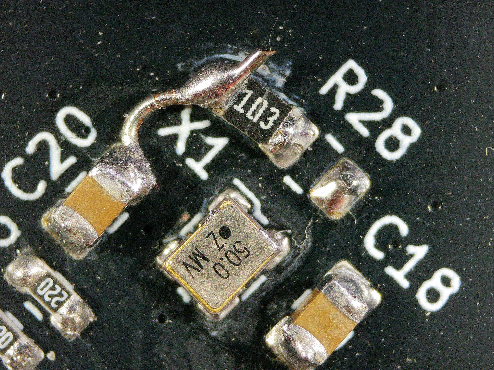
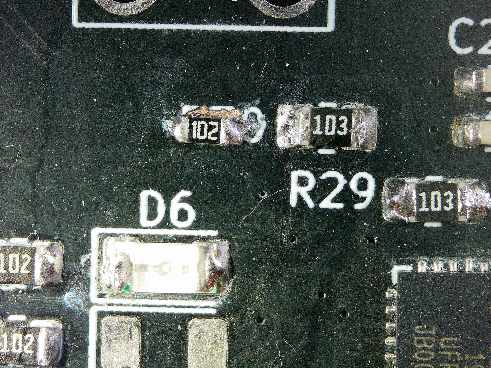

# Purpose
This document describes the hardware erratas and any potential fix using said hardware.

# E1041 Rev 1: Driver Board

## Errata 1: Crystal Enable
This issue is caused by a pull-up resistor on the enable line, which should be set as a pull-down to disable the crystal unless explicitly enabled by the MCU.

### Fix
For X1, have the pull-up resistor only soldered to the left pad (looking at the board up), then wire a short jumper between it and the nearby pad of the bypass capacitor to tie it to GND. See below:

## Errata 2: 50Mhz clock going to programming line
This issue is caused by GPIO0, which is both one of the programming lines and the 50Mhz Ethernet clock, being broken out to the programming header, which can cause signal integrity issue

### Fix
Either or both:
- Add a 1Kohm resistor in series between the programming line and GPIO0, as shown below
    - 
- Remove the programming connector as soon as you are finished programming. Even with the previous fix, there is still enough signal integrity issue

## Errata 3: 100M Ethernet Connection Issue
The Ethernet Phy fails to establish a connection with the ESP32 when running in the default 10/100M mode in esp32's ethernet library.
This is presumably caused by bad signal integrity due to 2-layer design, among other factors.

### Fix
In software reducing the Ethernet to 10M only seems to fix this.

## Errata 4: Supplying with only 5v over USB

When only USB power is supplied, the device periodically restarts

### Investigation Notes
- When proving 5v on USB, there is a spike on the uS scale to ~1v. This tells me this is getting loaded down somehow
- It is random when, from power on, the device restarts. Sometimes instant, sometimes several seconds before the next restart. This tells me I am operating right on the edge of failure/working
- When supplying the 12V barrel jack with 12V, I don't see a USB dropout issue. This tells me the 5/12v to 3.3v converter is OK, most likely problem is the 12V generation
- Suspecting it might be something to do with the 5v to 12v boost converter section

### Fix
Root cause awaiting, TODO
